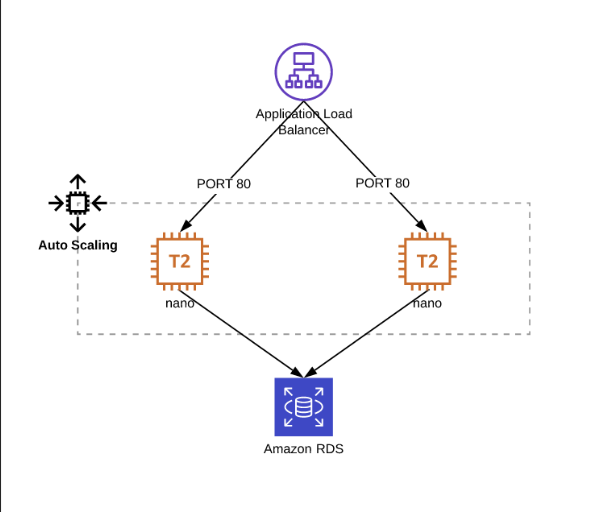

# Infrastructure deployment exercise

Using Terraform, automate the build of the following application in AWS. For the purposes of this challenge, use any Linux based AMI id for the two EC2 instances and simply show how they would be provisioned with the connection details for the RDS cluster.



There are a lot of additional resources to create even in this simple setup, you can use the code we have made available that will create some structure and deploy the networking environment to make it possible to plan/apply the full deployment. Feel free to use and/or modify as much or as little of it as you like.

Document any assumptions or additions you make in the README for the code repository. You may also want to consider and make some notes on:

How would a future application obtain the load balancer’s DNS name if it wanted to use this service?

What aspects need to be considered to make the code work in a CD pipeline (how does it successfully and safely get into production)?


# Notes - work in progress

## Solution

### Prerequisites
To deploy this project you first need to set these environment variables;
```bash
  export AWS_ACCESS_KEY_ID="<YOUR_ACCESS_KEY_ID>"
  export AWS_SECRET_ACCESS_KEY="<YOUR_SECRET_KEY>"
```

### Approach
**loadbalancer.tf**
- create a application loadbalancer in public subnet
- attach security group with ingress from internet on port 80, and egress to the autoscaling group on port 80

**compute.tf**
- create autoscaling group in private subnet with capacity of 2 ec2s 
- attach asg to the loadbalancer
- attach security group with ingress from loadbalancer on port 80, and egress to the RDS on port 3306

**rds.tf**
- create rds in private subnet
- attach security group with ingress from autoscaling group on port 3306

## Creating CICD pipeline
To run this on a CICD pipeline we should do the following:

**In AWS:**
- create S3 bucket with versioning for Terraform remote backend
- create dynamo-db table for Terraform remote backend
- create AWS access key to be used by CICD tool (such as Gitlab)

**In Terraform**
- use remote backend (S3 + dynamo-db)
- externalize any sensitive data (such as username and password of the RDS)
- create a outputs.tf file to contain any information from this stack that we wish to output

**In CICD**
- add secrets required for runtime, such as; AWS_ACCESS_KEY_ID, AWS_SECRET_ACCESS_KEY, RDS credentials (or use centralized secrets manager such as Vault)
- ensure that the image used in the CICD tool has relevant tooling available (i.e. Terraform) 
- create pipeline with steps to do:
  - "terraform init" to download providers and any modules used 
  - "terraform plan -out=prepared.plan" to plan the infrastructure and output it into a plan file
  - "terraform apply prepared.plan" to provision the planned infrastructure using the plan file to ensure consistency between steps
    - add a manual approval on this step to ensure that we have a final quality gate before deployment


- if this pipeline is used to deploy to several environment (such as dev and prod) then adopt GitOps approach 
  - feature branch can deploy to dev, and only once pull request is approved and merged into main can we deploy to prod (i.e. only main can deploy to prod)


## How to get loadbalancer DNS name

Applications on the EC2 should be able to retrieve this information from the instance metadata:
```bash
curl http://169.254.169.254/latest/meta-data/elasticloadbalancing/
```


## Lessons learned

**Security group dependencies**

The ASG and RDS Security groups have dependency on one another (ingress and egress rules) which was resulting in a terraform error, since terraform is unable to determine in which order to create the SGs. 

To resolve this issue we are creating empty security groups first, and then attaching rules to them.